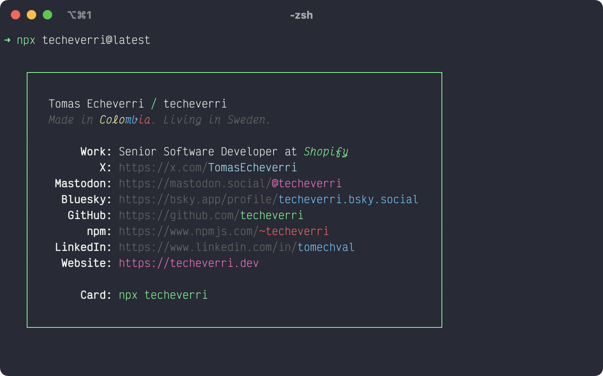

 [](https://github.com/techeverri/techeverri-cli/actions/workflows/ci.yml) [](https://badge.fury.io/gh/techeverri%2Ftecheverri-cli) [](https://badge.fury.io/js/techeverri)

### It's me Tomas! 👋

_Inspired by [bitandbang](https://github.com/bnb/bitandbang)'s card._

## Usage

### npm

To see my `npm` card, run the following command:

```sh
npx techeverri
```

## Development

### Prerequisites

- Requires [Node.js](https://nodejs.org/) (v16 or newer)

### Commands

| Command          | Description                       |
| ---------------- | --------------------------------- |
| `npm run print`  | Print the card                    |
| `npm run build`  | Build and print the card          |
| `npm run test`   | Run smoke tests (Jest)            |
| `npm run format` | Format all files (Prettier)       |
| `npm run lint`   | Run static code analysis (ESLint) |

## Screenshots


